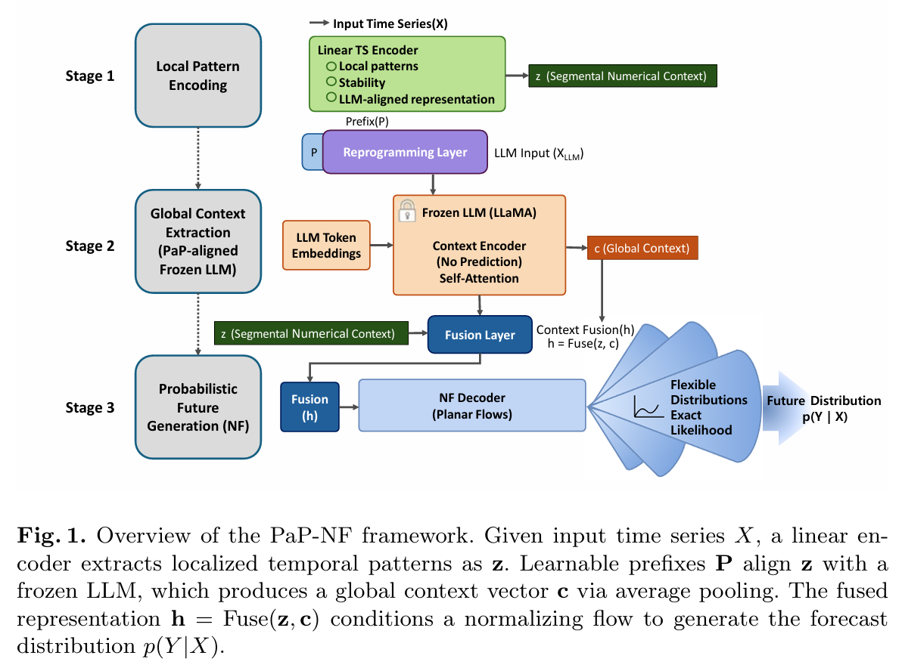

# PaP-NF: Probabilistic Long-Term Time Series Forecasting via Prefix-as-Prompt Reprogramming and Normalizing Flows

  
  
  

  <a href="./paper.pdf"> [Paper]</a> 

## 🌟 Overview

**PaP-NF** is a novel probabilistic forecasting framework that aligns continuous time series with a frozen Large Language Model (LLM) using a **Prefix-as-Prompt (PaP)** mechanism. By utilizing the LLM as a global context encoder and integrating it with Normalizing Flows, the framework captures complex future uncertainties without the precision loss typically associated with numerical discretization.

  

### Key Innovations
* **Principled Hybrid Framework**: Maintains local numerical fidelity through linear embeddings while leveraging frozen LLMs for sophisticated global reasoning.
* **Prefix-as-Prompt (PaP)**: Aligns numerical embeddings with pre-trained LLMs without modifying backbone parameters.
* **Uncertainty-Aware Forecasting**: Conditions normalizing flows on joint numerical and semantic contexts for precise density estimation.
* **High Efficiency**: Achieves $O(1)$ sampling speed, bypassing the iterative latency of diffusion-based models.

---

## 🏗️ Methodology

Our framework consists of a three-stage pipeline designed for robust long-term prediction:
1. **Local Encoding**: A linear encoder captures localized temporal dynamics.
2. **Global Context**: Learnable prefixes align temporal features with a frozen Llama-3.1 backbone to extract semantic context.
3. **Probabilistic Generation**: Conditional Normalizing Flows generate exact likelihood-based future distributions $p(Y|X)$.

---

## 📊 Datasets

The following benchmark datasets used in the paper can be obtained from the links below:

* **ETT (Electricity Transformer Temperature)**: Available at [ETDataset GitHub](https://github.com/zhouhaoyi/ETDataset). Includes ETTh1, ETTh2, ETTm1, and ETTm2.
* **Traffic**: Standard transportation dataset often hosted in [Autoformer](https://github.com/thuml/Autoformer) or [Time-Series-Library](https://github.com/thuml/Time-Series-Library).

Please place the downloaded `.csv` files under the `./data/` directory.

## 📊 Experimental Results

### 1. Competitive Point Forecasting
PaP-NF maintains superior accuracy across long-term horizons, notably outperforming state-of-the-art deterministic models like TimesNet on high-volatility datasets.

  

### 2. Robust Uncertainty Quantification
The model provides well-calibrated predictive distributions, achieving top-tier performance in Continuous Ranked Probability Score (CRPS) benchmarks.

  

---
  
# Citation
  @article{kim2026papnf,
  title={PaP-NF: Probabilistic Long-Term Time Series Forecasting via Prefix-as-Prompt Reprogramming and Normalizing Flows},
  author={Kim, Minju and Hur, Youngbum},
  journal={Submitted to International Conference on Pattern Recognition (ICPR)},
  year={2026}
}

