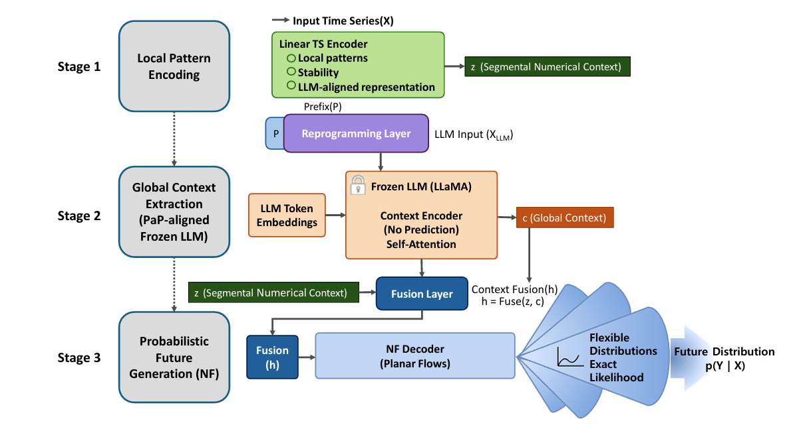
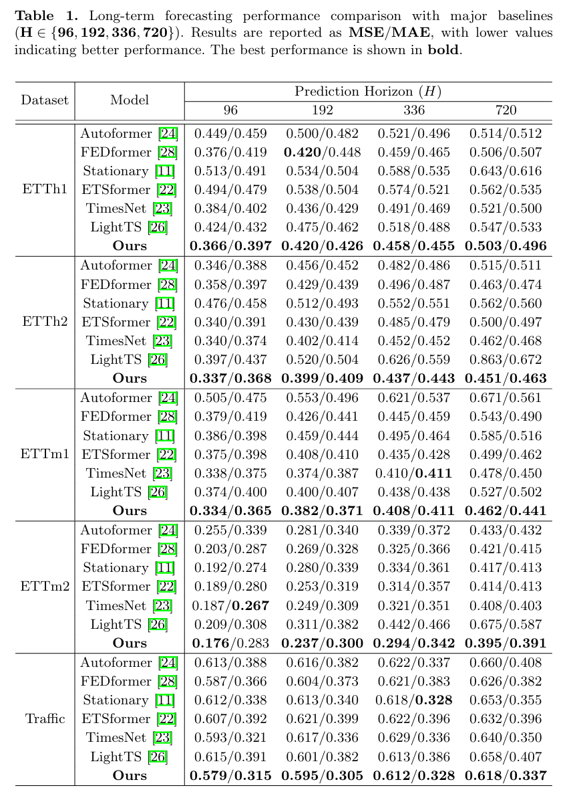
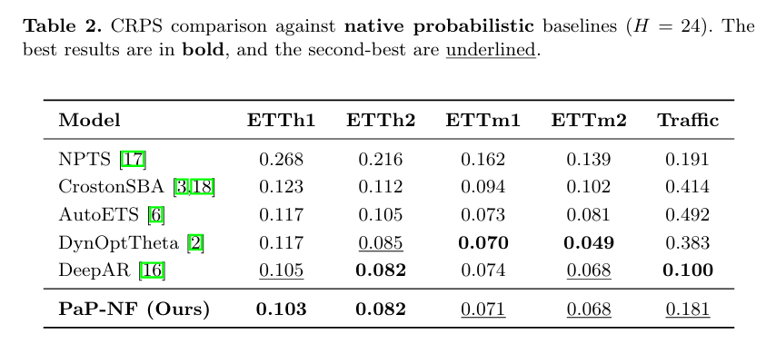

# PaP-NF: Probabilistic Long-Term Time Series Forecasting via Prefix-as-Prompt Reprogramming and Normalizing Flows

<p align="center">
  
  
  
</p>

## 🌟 Overview

**PaP-NF** is a probabilistic long-horizon forecasting framework that leverages a **Prefix-as-Prompt (PaP)** alignment mechanism to connect continuous time-series representations with a frozen Large Language Model (LLM). Rather than using the LLM as a direct predictor, PaP-NF treats it as a global context encoder whose semantic structure guides a Normalizing Flow decoder. This design preserves numerical precision and enables calibrated, multi-modal prediction of future trajectories.

<p align="center">
  
</p>

### Main Highlights

* **Hybrid Framework**: Preserves local numerical structure via linear embeddings and extracts global temporal patterns using a frozen LLM.
* **Prefix-as-Prompt (PaP)**: Projects numerical embeddings into learned prefix vectors that condition the LLM without updating backbone parameters.
* **Uncertainty-Aware Forecasting**: Uses conditional normalizing flows to produce reliable predictive distributions from both numerical and semantic contexts.

---

## 💾 Datasets

The following benchmark datasets used in the paper can be obtained from the links below:

* **ETT (Electricity Transformer Temperature)**: Available at [ETDataset GitHub](https://github.com/zhouhaoyi/ETDataset). Includes ETTh1, ETTh2, ETTm1, and ETTm2.
* **Traffic**: Standard transportation dataset often hosted in [Time-Series-Library](https://github.com/thuml/Time-Series-Library).

You can start training and evaluation by running main.py. Ensure your datasets are in the ./data/ folder.

```
PaP-NF/
 └─ data/
     ├─ ETTh1.csv
     ├─ ETTh2.csv
     ├─ ETTm1.csv
     ├─ ETTm2.csv
     └─ Traffic.csv
```
---

## 🚀 Getting Started

### 1. Environment Setup
Clone the repository and install the required packages.

```bash
git clone https://github.com/democracy04/PaP-NF.git
cd PaP-NF
pip install -r requirements.txt
```

### 2. Dataset & Config

Update dataset location inside the `Config` class in `main.py`:

```python
class Config:
    seq_len = 336
    pred_len = 96
    prefix_len = 16
    num_flows = 8
    root_path = './data'
    data_path = 'ETTm2.csv'
    llm_model_name = 'meta-llama/Meta-Llama-3.1-8B'
```

To use a different dataset, place the file in your chosen directory  
and update `root_path` and `data_path` accordingly.


### 3. Train & Evaluate

The current `main.py` automatically runs experiments for multiple horizons in a single pass:

```python
if __name__ == '__main__':
    horizons = [96, 192, 336, 720]
    for pred_len in horizons:
        ...
```

To launch the full experiment (all horizons) with the default configuration:

```bash
python main.py
```
---

## 📊 Experimental Results

### 1. Point Forecasting (MSE / MAE)
The following table reports point forecasting results (MSE/MAE) across multiple horizons.  

<p align="center">
  
</p>

### 2. Probabilistic Forecasting (CRPS)
The next table summarizes probabilistic forecasting performance using the CRPS metric.  

<p align="center">
  
</p>

---

## 📁 Project Structure

```
PaP-NF/
 ├─ data/
 ├─ data_loader.py
 ├─ metric.py
 ├─ main.py
 └─ requirements.txt
```


